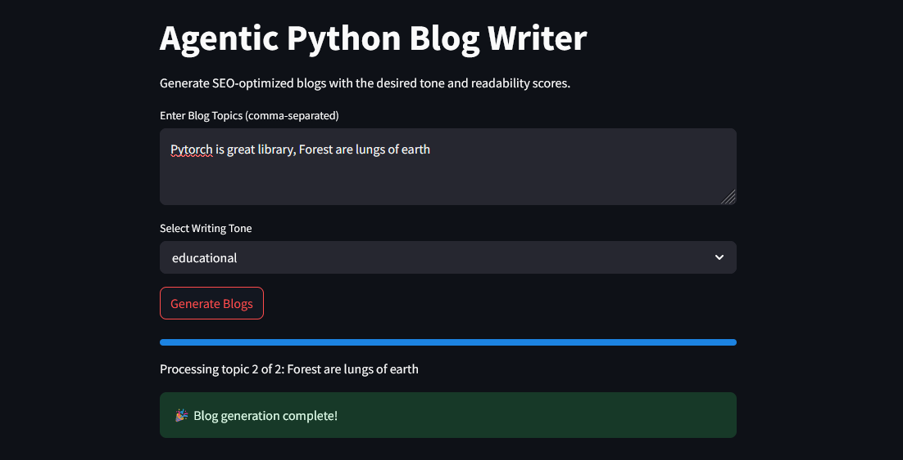
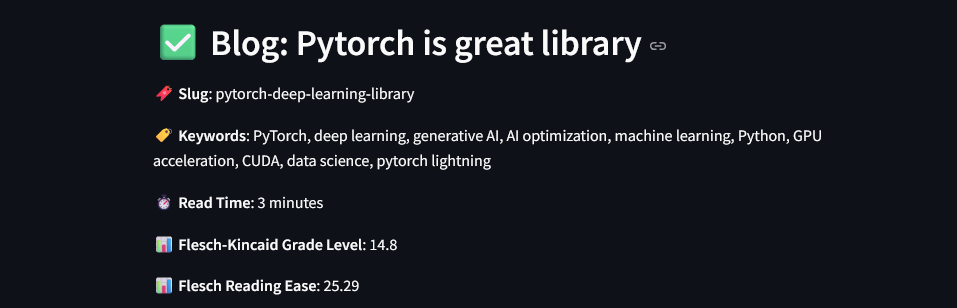
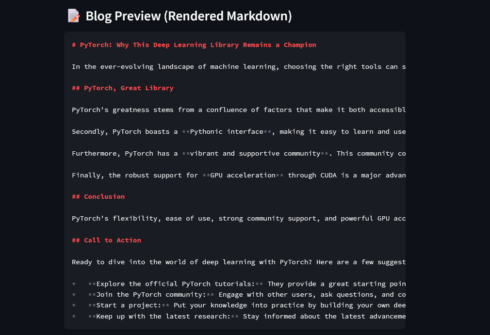
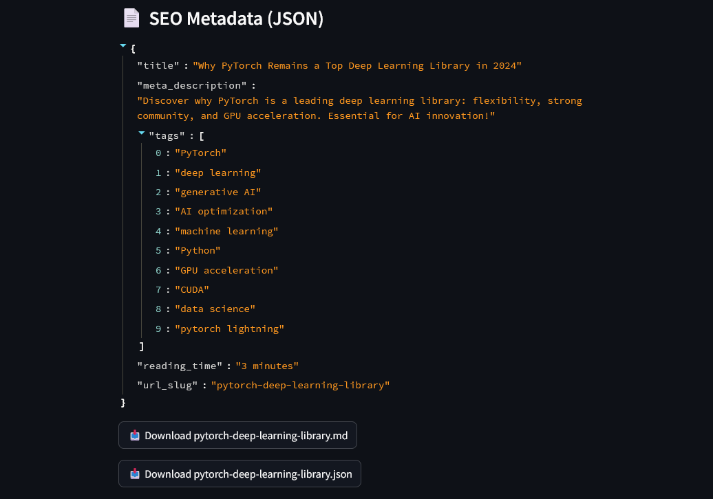

# 🧠 Agentic Python Blog Writer

## 🚀 Introduction

Greetings!  
Building this project has been an exciting journey. I’ve always aspired to create a tool like this—one that blends automation, research, and content generation seamlessly. This opportunity allowed me to push my limits and bring that vision to life. Let’s dive into the setup and usage guide!

---

## ⚙️ Setup Instructions

### 1. Clone the Repository

Open your terminal and run:

```bash
git clone https://github.com/Rohitsuper69/Agentic_Python_Blog_Writer-
cd Agentic_Python_Blog_Writer-
```

---

### 2. Create a Virtual Environment

Using Python’s `venv` module ensures isolated environments for dependencies.

#### ✅ Windows:

```bash
python -m venv venv
venv\Scripts\activate
```

#### ✅ macOS / Linux:

```bash
python3 -m venv venv
source venv/bin/activate
```

> If `venv` is not available, install it with:
>
> ```bash
> pip install virtualenv
> ```

---

### 3. Install Dependencies

Install all required Python packages using the `requirements.txt` file:

```bash
pip install -r requirements.txt
```

---

### 4. Set Environment Variables

Create a `.env` file in the root directory and add your API keys in the following format:

```env
NEWSDATA_API_KEY=your_newsdata_api_key_here
GEMINI_API_KEY=your_gemini_api_key_here
```

since this code uses gemini-2.0-flash model generate key of that model as pro was not accessable


### 5. Launch the App

Start the Streamlit application by running:

```bash
streamlit run streamlit.py
```

---

## 🧪 Usage Guide

Once the app is running:

- Enter multiple blog topics separated by commas (`,`).
- Choose a desired **tone** from the dropdown.
- Click **"Generate Blogs"**.
- For each topic, the app will:
  - Display the full blog content.
  - Show SEO metadata.
  - Provide download buttons for `.md` (Markdown) and `.json` files.
  - Display readability metrics (Flesch-Kincaid Grade Level and Reading Ease).

---

## 📸 Example Screenshots

| Web UI                            | Blog Output                       |
| --------------------------------- | --------------------------------- |
|  |  |
|  |  |

---

## Deploy

The code is also deployed so can directly use it also
[Link](https://rohitsuper69-agentic-python-blog-writer--streamlit-wutib5.streamlit.app/)
